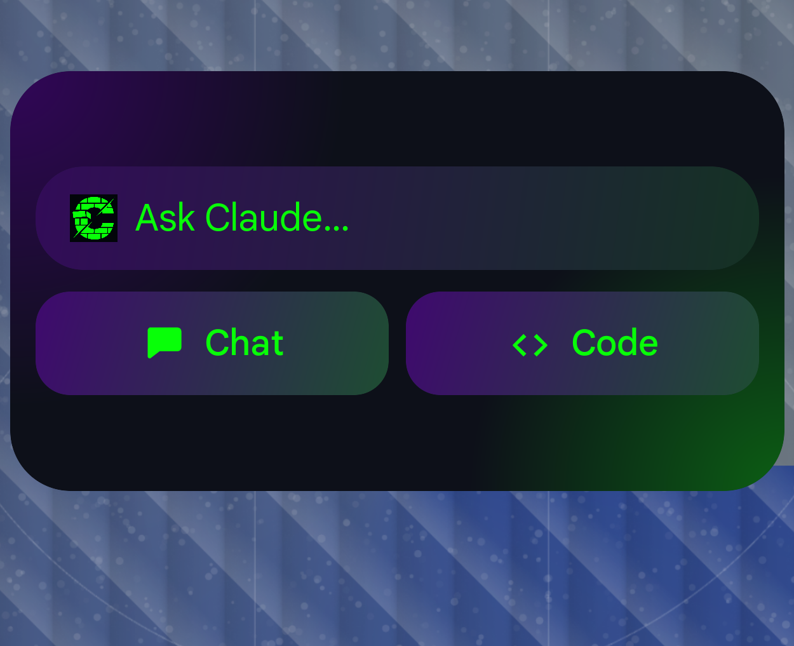

# Modern Claude Widget

[](https://github.com/clayboicardi/modern-claude-widget/actions/workflows/ci.yml)

A ChatGPT-style Android home-screen widget that deep-links straight into the [Claude](https://claude.ai) app. Two buttons — **Chat** and **Code** — plus an "Ask Claude…" pill that opens a fresh conversation. It's a pure deep-link launcher: **no backend, no API key, no `INTERNET` permission.**

> **Disclaimer — unofficial.** This is an independent, community project. It is **not affiliated with, endorsed by, or sponsored by Anthropic.** "Claude" is a trademark of Anthropic, PBC. All widget icons are original and do not reproduce Anthropic's (or any third party's) marks. The widget only launches the official Claude app through public deep links — it ships no Anthropic code, assets, or credentials.

## Screenshot



## What it does

| Tap | Opens |
|---|---|
| **Ask Claude…** pill | A new conversation composer (`claude://new`) |
| **Chat** | A new conversation composer (`claude://new`) |
| **Code** | The Code / Remote Control list (`claude://code`) |

If the Claude app isn't installed, the widget falls through to the Play Store listing.

## How it works

The UI never hard-codes a single intent. Each button looks up a `Destination` in a small registry and walks an **ordered list of launch attempts**, stopping at the first that succeeds:

```
ViewUri(claude://…)  →  Claude app launcher  →  Play Store (market:// then https)
```

- Launches fire from an `actionRunCallback` (not `actionStartActivity`), keyed on a per-button parameter so each button keeps its own identity.
- Every `Intent` is built from the registry — a `Parcelable` intent is never forwarded from widget extras (intent-redirection hardening).
- Unknown/missing actions **fail closed** to simply opening Claude, never crash.
- Routes were validated on-device against the real Claude app; see [`docs/route-probe.md`](docs/route-probe.md).

## Build & run

**Requirements:** JDK 17+, Android SDK with **API 37** platform + **Build-Tools 37**, a device/emulator on Android 12+ (minSdk 31). The Gradle wrapper pins AGP 9.2 / Gradle 9.4.1.

**Android Studio:** open the project, let it sync, and Run the `app` configuration onto a device. Then long-press the home screen → **Widgets** → **Modern Claude Widget**.

**Command line:**
```bash
./gradlew test          # JVM unit tests
./gradlew assembleDebug  # build the debug APK
./gradlew installDebug   # install to a connected device
```

## Tech stack

- **Kotlin** + **Jetpack Glance** (`androidx.glance:glance-appwidget`) — Compose-style widgets rendered as RemoteViews.
- Single module, package `com.clayboicardi.claudewidget`.
- compileSdk / targetSdk **37** (Android 17), minSdk **31**.

## Design

The widget is rendered with Jetpack Glance, which is far more constrained than web/CSS. If you're iterating on the visual design, read [`DESIGN.md`](DESIGN.md) first — it documents what Glance can and can't render so designs stay buildable.

## Extending it

Adding a button is one `Destination` (an ordered attempt list) + a drawable + one `clickable`. The registry and launcher are already generic. Example hooks (validated): a prefilled Code task via `claude://code/new?q=<url-encoded>`.
